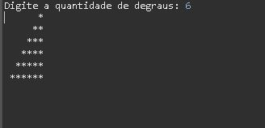
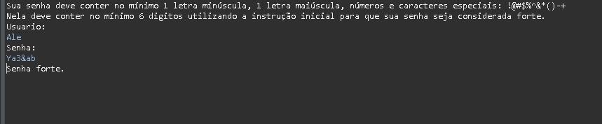

<h1 align="center">
  
</h1>

<h1 align="center">Academia Capgemini</h1>

## Tópicos
=================
<!--ts-->
   - [Tópicos](#tópicos)
   - [Sobre](#sobre)
   - [Pré-requisitos](#pré-requisitos)
   - [Tecnologias](#tecnologias)
   - [Instalação](#instalação)
      - [Clone este repositório](#clone-este-repositório)
      - [Abra o terminal cmd](#abra-o-terminal-cmd)
      - [Acessar arquivo](#acessar-arquivo)
   - [Autora](#autora)
<!--te-->

## Sobre

Projeto para a etapa de seleção de participação da Academia Capgemini. 

### Pré-requisitos

Antes de começar, você vai precisar ter instalado em sua máquina as seguintes ferramentas:
[Git](https://git-scm.com). 
Além disto é bom ter um editor para trabalhar com o código como [VSCode](https://code.visualstudio.com/) e [Eclipse](https://img.shields.io/badge/Eclipse-FE7A16.svg?style=for-the-badge&logo=Eclipse&logoColor=white)

### Tecnologias

 </a>     

## Instalação

### Clone este repositório
$ git clone <https://github.com/AlexaPim/desafio.cap>

### Abra o terminal cmd
$ cd desafio.cap

### Acessar arquivo
$ cd Desafio

## Aplicação das questões

<h4>Questão 1</h4>

    </img>

#### Questão 2

    </img>

#### Questão 3

    </img>

## Autora
<a href="https://www.linkedin.com/in/alexssandra-pimentel/" target="_blank" rel="noreferrer">Contato</a>

